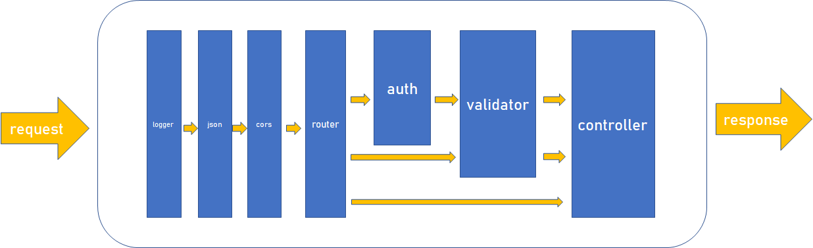

> 一个基于开源项目realworld的api接口实现（Express）

- 项目地址：https://github.com/gothinkster/realworld

- api文档地址：https://realworld-docs.netlify.app/docs/specs/backend-specs/endpoints

----
## Middleware

- 请求体解析
  - `express.json()`
  - `express.urlencoded()`

- 日志输出
  - `morgan()`

- 跨域请求
  - `cors()`

- 数据验证
  - `express-validator`: 对body中的数据字段做验证
